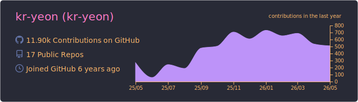
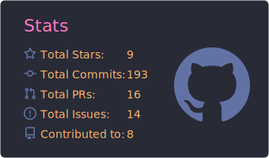
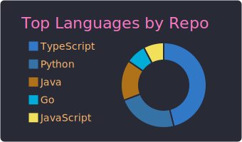
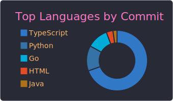

<h1 align="center">kr-yeon</h1>

  <strong>Mobile · Backend · Systems Integration</strong> 
  React Native · Kotlin · Swift · Kubernetes

  앱, API, 외부 시스템이 맞물리는 일을 합니다.

  

## 소개

React Native, Kotlin, Swift로 모바일 앱을 개발하고 TypeScript 백엔드와 연결합니다. 앱 기능부터 인증, 결제, 증명, 팩스, 공공 API 연동처럼 운영 중 변수가 많은 영역까지 맡아 왔습니다.

새 기능을 빨리 붙이는 것보다 배포 뒤에도 잘 돌아가는 구조를 만드는 데 관심이 많습니다. OTA로 처리할 변경과 스토어 배포가 필요한 변경을 나눕니다. 외부 연동도 성공 응답만으로 끝내지 않고 최종 상태와 재시도까지 확인합니다. Docker와 Kubernetes 환경의 서비스 배포와 운영 구성도 함께 다룹니다.

## 작업 영역

<table>
  <tr>
    <td width="50%" valign="top">
      
    </td>
    <td width="50%" valign="top">
      <h3>모바일 플랫폼</h3>
      
React Native를 중심으로 Kotlin과 Swift를 함께 사용합니다. 화면 구현뿐 아니라 네이티브 기능, 배포 제약, OTA 적용 범위까지 제품 단위로 봅니다.

      
<code>React Native</code> <code>Kotlin</code> <code>Swift</code> <code>iOS</code> <code>Android</code>

    </td>
  </tr>
  <tr>
    <td width="50%" valign="top">
      <h3>서비스와 인프라</h3>
      
TypeScript 백엔드와 Rust 라이브러리를 만들고, 인증·결제·증명·팩스처럼 연동 규칙이 까다로운 영역을 다룹니다. Docker와 Kubernetes는 배포와 운영 구성에 사용합니다.

      
<code>TypeScript</code> <code>Bun</code> <code>Rust</code> <code>Docker</code> <code>Kubernetes</code>

    </td>
    <td width="50%" valign="top">
      
    </td>
  </tr>
</table>

## 주력 분야

| 분야 | 해온 일 |
| --- | --- |
| 모바일 | React Native, Kotlin, Swift 기반 앱 개발, iOS·Android 네이티브 기능 구현, OTA 배포 제약 관리 |
| 백엔드 | TypeScript, Node.js, Bun 기반 REST API, 인증·권한·도메인 로직 설계 |
| 시스템 연동 | 세금·증명·결제·인증·팩스·공공 API 등 외부 시스템 연동과 장애 대응 |
| 보안 | ECDH, HKDF, AES-256-GCM, KMS를 활용한 요청 암호화와 재전송 방지 처리 |
| Rust | 레거시 Java 클라이언트 분석, 프로토콜 호환 구현, 네트워크·파일 처리 라이브러리 개발 |
| 데이터·운영 | PostgreSQL, Prisma, Docker, Kubernetes, CLI와 개발 자동화 도구 구성 |

## 일하는 방식

- 화면, 도메인 로직, 인프라, 파일 시스템 접근을 한곳에 섞지 않습니다.
- 명세가 불완전한 연동은 기존 구현과 실제 패킷부터 확인합니다.
- 암호화나 상태 전이처럼 놓치기 쉬운 부분은 코드 경계와 테스트에 남깁니다.
- 변경 뒤에는 타입 검사, 테스트, 로그, 실제 연동 결과로 근거를 남깁니다.

## 코드 스타일과 작업 성향

문제가 생기면 추측부터 하지 않고 기존 코드와 로그, 실제 요청·응답을 먼저 확인합니다. 레거시 연동에서는 문서보다 이미 운영 중인 동작을 더 신뢰하는 편입니다.

| 기준 | 코드에서 지키는 방식 |
| --- | --- |
| 경계 | 화면과 라우트는 얇게 둡니다. 상태 전이와 기능 정책은 기능 훅이나 서비스에 둡니다. HTTP·CLI·네이티브 모듈·DB·외부 SDK는 각 어댑터 경계에서 처리합니다. |
| 프론트엔드 | 화면은 UI와 사용자 상호작용에 집중합니다. 원격 데이터와 입력·선택·모달 같은 로컬 상태를 한데 섞지 않습니다. 네비게이션·파일·권한·네이티브 모듈은 화면과 분리합니다. |
| 백엔드 | 컨트롤러는 요청과 응답을 맡습니다. 서비스는 권한·규칙·작업 순서를 조율합니다. DB 쿼리와 외부 제공자 세부는 리포지토리나 클라이언트 경계에 둡니다. |
| 타입과 계약 | 바깥에서 들어오는 값은 경계에서 한 번 검증·정규화합니다. 내부 상태는 모호한 문자열이나 `any`보다 타입으로 표현합니다. 공개 응답과 오류 형식은 안정적으로 유지합니다. |
| 부수 효과 | DB 변경, 네트워크 호출, 파일 처리, 배포 작업은 이름이 있는 경계에서 실행합니다. 여러 변경이 한 업무라면 트랜잭션 범위와 실패 뒤 처리 방식을 먼저 정합니다. |
| 검증 | 성공 응답만으로 끝내지 않습니다. 실패, 취소, 재시도, 최종 완료 상태까지 확인합니다. 작은 테스트나 재현 가능한 점검으로 변경을 증명합니다. |

새 레이어나 의존성을 필요도 없이 추가하지 않습니다. 먼저 프로젝트에 있는 방식과 공개 계약을 살피고 필요한 만큼만 고칩니다. 파일 수보다 책임이 분명한지를 더 중요하게 봅니다.

작업은 작은 변경으로 시작해 확인하면서 넓혀 갑니다. 기존 사용자의 흐름이나 배포 환경을 조용히 깨뜨리는 변경은 피합니다. 제약이 있으면 숨기지 않고 먼저 공유합니다.

## 함께 다루는 기술

Kotlin과 Swift로 Android·iOS 기능을 구현하고 React Native와 연결합니다. Docker와 Kubernetes로 실행 환경과 배포 구성을 관리합니다. Java는 레거시 분석과 호환성 작업에, Python은 자동화와 진단 도구에 주로 씁니다.

머신러닝 모델 연구, 3D·게임 그래픽, 브랜드 아트디렉션은 주력 분야로 소개하지 않습니다. 필요한 경우 제품 개발 관점에서 협업합니다.

## 실무에서 다룬 문제

비공개 프로젝트를 포함해 모바일 배포, 세금·증명 서비스, 결제, 인증, 팩스, 관리자 도구, 인프라 작업을 해 왔습니다.

<table>
  <tr>
    <td align="center" width="25%"><strong>13.11k</strong> 최근 12개월 GitHub 기여</td>
    <td align="center" width="25%"><strong>17</strong> 공개 리포지토리</td>
    <td align="center" width="25%"><strong>46</strong> 로컬 Git 저장소</td>
    <td align="center" width="25%"><strong>8</strong> 기여한 공개 프로젝트</td>
  </tr>
</table>

GitHub 수치는 프로필 요약 카드가 생성된 최신 스냅샷을 기준으로 합니다.

## 기술

`React Native` `Kotlin` `Swift` `React` `TypeScript` `JavaScript` `Node.js` `Bun` `Rust` `PostgreSQL` `Prisma` `Docker` `Kubernetes` `REST API` `iOS` `Android` `Java` `Python`

## GitHub 활동

  
  

  
  

  <a href="https://github.com/kr-yeon">GitHub 프로필 보기</a>

